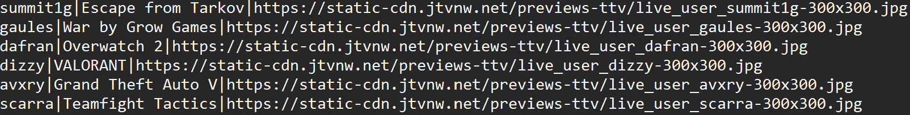

<h1>Twitch API</h1>

<h3>What?</h3>
Will generate a list of buttons that with a click, will open VLC media player and start the appropriate video(stream). 

<h3>Why?</h3>
During Q4 2021 livestreaming platform Twitch started aggressively forcing ads on its users. 
At the time, viewing a stream through 3rd party video players would circumvent said ads. 
I wanted to make a tool that would make it possible to view my favourite streams with the least possible clicks.   

<h2>Program</h2> 

 
For an API request of the top 50 most followed channels, above is the result. 
Additionally there is a textbox for any another channel outside of the top 50.   

<h2>API Response (Text File)</h2> 

 
There was a time that I was thinking to use both the current game directory as well as thumbnail 
to further increase the utility of the program but said ideas were never explored.
